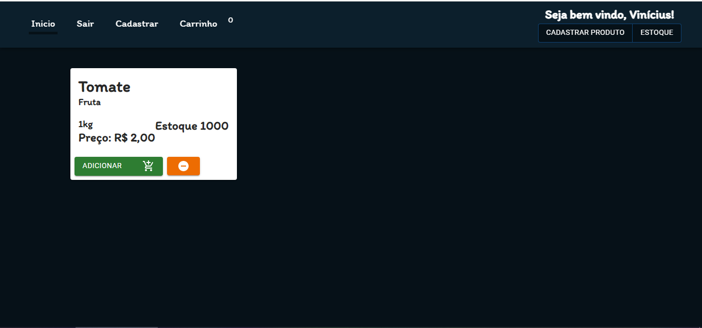
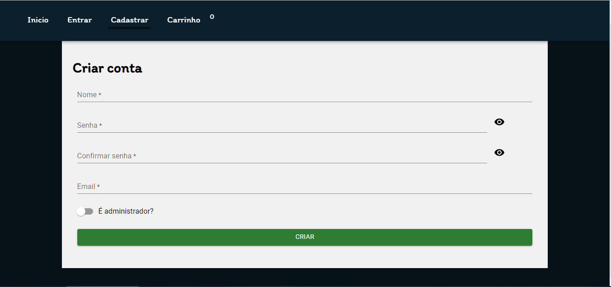
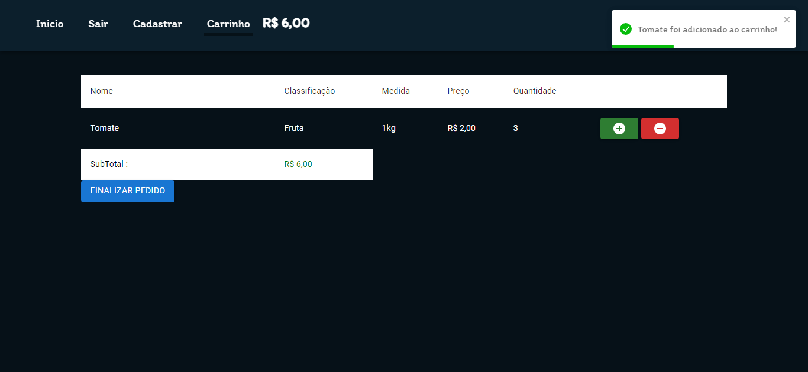
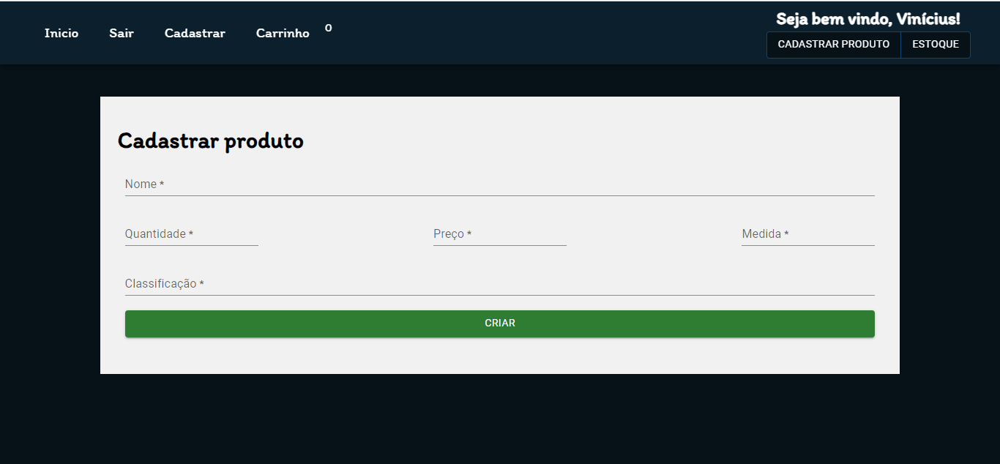
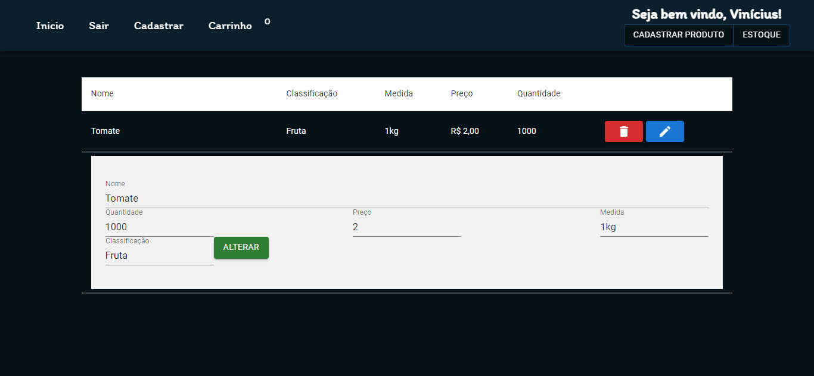

<h1 align="center">Desafio Frexco</h1>

## Objetivo

Você foi contratado para criar uma aplicação de controle de estoque. Cada vez que um produto for vendido o mesmo deverá ser debitado do estoque.

## Observações

- Para validar o requisito "Cada vez que um produto for vendido o mesmo deverá ser debitado do estoque", também criei um sistema de vendas, para simular uma venda.
- Na tela de "Criar conta" existe a possibilidade de registrar o usuário como administrador, essa é uma forma de facilitar no teste da aplicação.

## Tecnologias utilizadas

### Front-end

- reactJS
- typescript
- axios
- react-toastify
- materialUI
- react-hook-forms
- react-router-dom

## Requisitos mínimos

- Ter o [nodeJS](http://nodejs.org) instalado na sua maquina

## Como rodar 🚀

- Pasta do Back-end

  - Abra o diretório do back-end em um terminal
  - Execute ` npm install` para baixar as dependências
  - Execute ` npm start` para executar o servidor

- Pasta do Front-end
  - Abra o diretório do front-end em outro terminal
  - Execute ` npm install` para baixar as dependências
  - Execute ` npm start` para executar a aplicação
  - A aplicação abrirá em http://localhost:3000

## Screenshots

Pagina inicial

Pagina para criar uma conta

Pagina para entrar em uma conta

Pagina para ver os produtos no carrinho e finalizar a compra

Pagina para criar um novo produto

Pagina para editar e deletar os produtos existentes

### Requisitos da aplicação

- Inicio

  - [x] Ao clicar em adicionar, deve debita estoque e creditar produto no carrinho
  - [x] O valor creditado deve ser acumulado e apresentado no cabeçalho da página

- Carrinho

  - [x] Deve apresentar os produtos
  - [x] Deve ter os botôes de adicionar e remover quantidade do produto
  - [x] Deve apresentar o subtotal
  - [x] Para finalizar a compra, deve estar logado e não ser administrador
  - [x] Ao clicar em Finalizar compra, deve creditar estoque e debitar produto no carrinho

- Criar conta

  - [x] Se as senhas não forem iguais, vai ser lançado um erro
  - [x] Ao finalizar a criação, os campos são limpados

- Login

  - [x] Ao fazer o login, o usuário será redirecionado a pagina Inicio
  - [x] Se o cliente estiver logado, ele não pode entrar na pagina de Entrar novamente

- Estoque

  - [x] Se alguem entrar no link de estoque sem estar logado como usuário administrador, vai ser redirecionado para a tela inicial
  - [x] O produto deletado ou atualizado irá automaticamente atualizar a lista de produtos na pagina de Inicio e no Estoque

- Cadastrar produto

  - [x] Se alguem entrar no link de estoque sem estar logado como usuário administrador, vai ser redirecionado para a tela inicial
  - [x] O produto cadastrado irá automaticamente ser adicionado na pagina de Inicio e no Estoque
